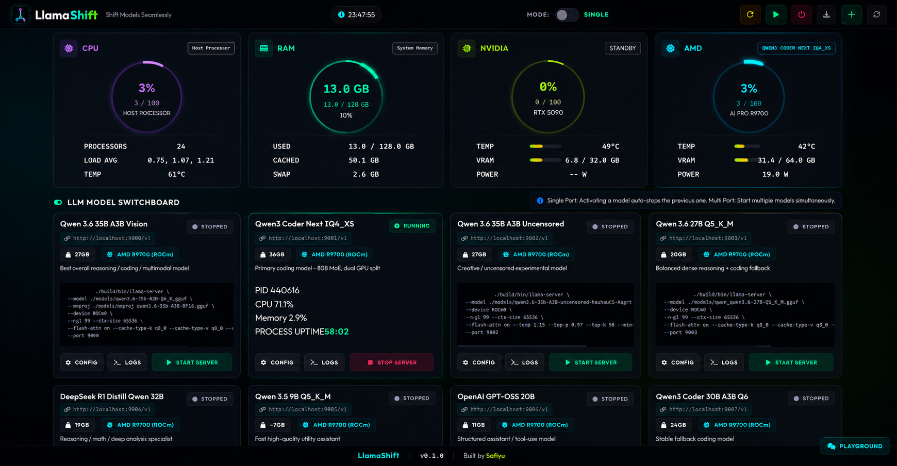

# LlamaShift

**Llama Model Manager** — A powerful, GPU-aware web-based control panel for managing multiple local Llama models with seamless switching between single-port and multi-port modes.


---

## Overview

LlamaShift is a comprehensive LLM model management platform that enables users to run, switch between, and monitor multiple local Llama models through an intuitive web interface. Built on Flask and powered by llama.cpp, LlamaShift provides seamless model switching with GPU acceleration support for both NVIDIA CUDA and AMD ROCm devices.

### Key Capabilities

- **Single-Port Mode**: Run one model at a time on a shared port — ideal for integration with Open WebUI and other LLM frontends that expect a single endpoint.
- **Multi-Port Mode**: Host multiple models simultaneously, each on its own dedicated port, enabling parallel inference workloads.
- **GPU-Aware Management**: Auto-detects NVIDIA CUDA and AMD ROCm GPUs, with configurable GPU layer offloading for optimal performance.
- **Real-Time Monitoring**: Live system stats, GPU memory usage, temperature, and utilization metrics in a dark-themed dashboard.
- **One-Click Model Switching**: Start, stop, or switch between models instantly from the web interface.
- **Live Log Streaming**: View model inference logs directly in the browser for real-time monitoring.
- **MCP Integration**: Model Context Protocol support for AI agent workflows.
- **Smart Auto-Restart**: Cross-platform service management with automatic recovery (systemd on Linux, Task Scheduler on Windows, Docker restart policies).
- **OpenAI-Compatible API**: Full OpenAI-style endpoints for easy integration with existing tools and applications.



## Features

| Feature | Description |
|---------|-------------|
| Single-Port Mode | Run one model at a time on shared port — ideal for Open WebUI integration |
| Multi-Port Mode | Host multiple models simultaneously, each on its own dedicated port |
| GPU-Aware Management | Auto-detects NVIDIA CUDA and AMD ROCm, configurable GPU layer offloading |
| Real-Time Monitoring | System stats, GPU memory/temperature/utilization, model status dashboard |
| One-Click Switching | Start, stop, or switch models instantly from the web interface |
| Live Log Streaming | View model inference logs directly in the browser |
| MCP Integration | Model Context Protocol support for AI agent workflows |
| Smart Auto-Restart | Cross-platform service management (systemd / Task Scheduler / Docker) |
| OpenAI-Compatible API | Full OpenAI-style endpoints for easy tool integration |
| Dark Theme UI | Modern, responsive web interface at `http://localhost:8002` |

## Architecture

```
┌─────────────────┐    ┌───────────────────────┐    ┌─────────────────┐
│   Web UI         │    │    LlamaShift         │    │   LLM Models    │
│  (Port 8002)     │───▶│   (server.py)         │───▶│  (llama-server) │
└─────────────────┘    │                       │    └─────────────────┘
                       │  ┌───────────────────┐│
                       │  │   MCP Server      ││
                       │  │  (stdio transport) ││
                       │  └───────────────────┘│
                       └───────────────────────┘
```


---

## Prerequisites

### Required (All Platforms)

| Dependency | Minimum Version | Recommended | Purpose |
|------------|-----------------|-------------|---------|
| **Python** | 3.10 | 3.11+ | Backend server runtime |
| **pip** | 23.0+ | Latest | Python package manager |
| **llama.cpp server** | Any recent build | Latest release | LLM inference engine |
| **GGUF Model Files** | — | — | Your quantized model weights |

### Python Packages (Auto-Installed)

The installers handle these automatically:

| Package | Minimum Version | Purpose |
|---------|-----------------|---------|
| `flask` | >= 3.0.0 | Web server + API |
| `requests` | >= 2.28.0 | HTTP client for model health checks |
| `psutil` | >= 5.9.0 | System resource monitoring |

### Optional (Platform-Specific)

| Dependency | Platform | Purpose |
|------------|----------|---------|
| **sudo** | Linux | Required for systemd service installation |
| **NVIDIA CUDA toolkit** | Linux / Windows | GPU acceleration for NVIDIA cards |
| **AMD ROCm** | Linux | GPU acceleration for AMD cards |
| **Docker + Docker Compose** | Any | Containerized deployment |
| **NSSM** | Windows | Professional-grade Windows service (downloaded auto) |

### Access Requirements

| Platform | Access Level | Why |
|----------|--------------|-----|
| **Linux** | `sudo` / root | Create systemd service, bind privileged ports |
| **macOS** | User (admin for launchd) | Launch agent/service registration |
| **Windows** | Administrator | Task Scheduler, NSSM service, UAC prompt |
| **Docker** | Docker socket access | Container management, GPU passthrough |

---

## Quick Start

### Option A: Interactive Installer (Recommended)

#### Linux / macOS

```bash
# 1. Clone the repository
git clone https://github.com/your-repo/llama-switcher.git
cd llama-switcher

# 2. Run the installer (installs dependencies, prompts for config)
chmod +x install_linux_mac.sh
./install_linux_mac.sh
```

The installer will:
1. Verify Python 3.10+ and pip
2. Install Flask, requests, psutil
3. Detect GPU (NVIDIA / AMD / CPU)
4. Find GGUF models in your model directory
5. Configure ports, context size, GPU layers
6. Set up background service (systemd on Linux)

#### Windows

**Method 1 — GUI Wizard (Recommended):**
```
Right-click install_windows_gui.ps1 → "Run with PowerShell"
```

**Method 2 — Batch Launcher:**
```
Double-click install_windows.bat
(Auto-prompts for Administrator via UAC)
```

Both wizards walk through 5 steps:
1. **Prerequisites** — Python check, dependency installation, llama-server path
2. **GPU Configuration** — CUDA/ROCm detection, layer offloading, mode selection
3. **Model Setup** — GGUF discovery, directory scanning, name/port/context config
4. **Service** — Task Scheduler / NSSM Windows Service / Manual only
5. **Review & Install** — Summary card, one-click install

### Option B: Docker (Isolated, No System Changes)

```bash
git clone https://github.com/your-repo/llama-switcher.git
cd llama-switcher
docker compose up -d --build
# Open http://localhost:8002
```

> **Note:** The Docker container runs in `--privileged` mode with `pid: host` so it can see and manage llama-server processes on the host. Only use on trusted machines.

### Option C: Manual Setup (Advanced Users)

```bash
# 1. Clone and install dependencies
git clone https://github.com/your-repo/llama-switcher.git
cd llama-switcher
pip install -r requirements.txt

# 2. Edit config.json
#    - Set binaryPath to your llama-server executable
#    - Set dataDir to your GGUF models directory
#    - Add model entries

# 3. Run the server
python3 server.py                # Manual (Ctrl+C to stop)

# OR on Linux with auto-restart:
sudo bash install_service.sh     # Creates systemd service
```

---

## Configuration

### config.json

| Field | Type | Required | Description |
|-------|------|----------|-------------|
| `appName` | string | No | Display name (default: `"llamashift"`) |
| `serviceName` | string | No | Systemd/service name (default: `"llamashift"`) |
| `masterPort` | int | No | Default model port (default: `9000`) |
| `binaryPath` | string | **Yes** | Path to `llama-server` binary |
| `dataDir` | string | **Yes** | Directory containing GGUF model files |
| `mode` | string | No | `"single_port"` or `"multi_port"` |
| `models` | object | **Yes** | Model definitions (see below) |

### Model Entry

```json
{
  "models": {
    "phi4": {
      "id": "phi4",
      "name": "Phi-4 Q8",
      "filename": "phi-4-Q8_0.gguf",
      "port": 9001,
      "ctxSize": 16384,
      "nParallel": 2,
      "nGpuLayers": 99,
      "endpoint": "http://localhost:9001/v1"
    }
  }
}
```

| Field | Type | Default | Description |
|-------|------|---------|-------------|
| `id` | string | — | Unique model identifier (no spaces/special chars) |
| `name` | string | — | Display name shown in UI |
| `filename` | string | — | GGUF filename inside `dataDir` |
| `port` | int | `masterPort` | HTTP API port for this model |
| `ctxSize` | int | `16384` | Context window size in tokens |
| `nParallel` | int | `1` | Number of parallel request streams |
| `nGpuLayers` | int | `99` | Number of layers offloaded to GPU (`999` = all) |
| `endpoint` | string | auto | OpenAI-compatible API endpoint URL |

### Updating Runtime Parameters

Change context size, parallelism, GPU layers without editing config:

```bash
curl -X PATCH http://localhost:8002/api/models \
  -H "Content-Type: application/json" \
  -d '{
    "model": "phi4",
    "updates": {
      "ctxSize": 32768,
      "nParallel": 4,
      "nGpuLayers": 99
    }
  }'
```

---

## API Endpoints

| Method | Endpoint | Description |
|--------|----------|-------------|
| **GET** | `/` | Web UI dashboard |
| **GET** | `/api/status` | System status + running models |
| **GET** | `/api/config` | Current configuration + runtime env |
| **POST** | `/api/config` | Update mode (`single_port` / `multi_port`) |
| **GET** | `/api/models` | List all configured models |
| **PATCH** | `/api/models` | Update model runtime parameters |
| **POST** | `/api/start` | Start a model |
| **POST** | `/api/stop` | Stop a model |
| **POST** | `/api/stop_all` | Stop all running models |
| **POST** | `/api/restart` | Restart the server (cross-platform) |
| **GET** | `/api/logs?model=ID` | Streaming logs for a model |
| **GET** | `/api/gpu` | GPU memory, temperature, utilization |
| **GET** | `/api/mcp` | MCP server status |
| **POST** | `/api/mcp` | Start/stop MCP server |

---

## File Structure

```
llama-switcher/
├── install_linux_mac.sh       # Linux/macOS installer launcher (bash)
├── install_linux_mac.py       # Linux/macOS interactive installer (Python)
├── install_windows_gui.ps1    # Windows GUI installer (PowerShell wizard)
├── install_windows.bat        # Windows batch launcher (auto-elevates)
├── install_service.sh         # Legacy: direct systemd service installer
├── server.py                  # Main backend server (cross-platform)
├── mcp_server.py              # MCP server for AI agent integration
├── config.json                # Model configuration (auto-generated)
├── requirements.txt           # Python dependencies
├── Dockerfile                 # Docker container definition
├── docker-compose.yml         # Docker Compose with GPU passthrough
├── .dockerignore              # Docker build exclusions
├── README.md                  # This file
│
└── static/
    ├── index.html             # Web UI template
    ├── index.css              # Dark theme styles
    ├── index.js               # Client-side JavaScript
    └── logo.png               # Application logo
```

---

## Troubleshooting

### Common Errors and Solutions

#### `Python 3.10+ not found`

**Cause:** System Python is older than 3.10, or Python is not in PATH.

**Fix:**
```bash
# Ubuntu/Debian
sudo apt update && sudo apt install python3.10 python3.10-venv python3-pip

# Fedora/RHEL
sudo dnf install python3.11 python3-pip

# Arch Linux
sudo pacman -S python python-pip

# macOS
brew install python@3.12

# Windows
# Download from https://www.python.org/downloads/
# IMPORTANT: Check "Add Python to PATH" during installation
```

#### `pip: command not found`

**Cause:** pip is not installed or not in PATH.

**Fix:**
```bash
# Use python3 -m pip instead
python3 -m pip install flask requests psutil

# Or install pip
curl -sS https://bootstrap.pypa.io/get-pip.py | python3
```

#### `ModuleNotFoundError: No module named 'flask'`

**Cause:** Python dependencies not installed, or wrong Python environment.

**Fix:**
```bash
# Install from requirements.txt
pip install -r requirements.txt

# Or install individually
pip install "flask>=3.0.0" "requests>=2.28.0" "psutil>=5.9.0"

# If using virtual environment
python3 -m venv venv
source venv/bin/activate     # Linux/macOS: venv\Scripts\activate on Windows
pip install -r requirements.txt
```

#### `llama-server: command not found` or binary validation fails

**Cause:** `binaryPath` in config.json is incorrect, or llama.cpp is not installed.

**Fix:**
1. Download llama.cpp from https://github.com/ggerganov/llama.cpp/releases
2. Or build from source:
```bash
git clone https://github.com/ggerganov/llama.cpp.git
cd llama.cpp
mkdir build && cd build
cmake .. -DLLAMA_CUDA=ON      # NVIDIA
# or
cmake .. -DLLAMA_HIPBLAS=ON   # AMD ROCm
cmake --build . --config Release
```
3. Update `binaryPath` in `config.json` to the full path of `llama-server` (or `llama-server.exe` on Windows)

#### `No GGUF models found` during installation

**Cause:** Installer cannot find `.gguf` files in default search paths.

**Fix:** The installer will prompt for your model directory path. If you haven't downloaded models yet:

1. Download GGUF models from [HuggingFace](https://huggingface.co/models?library=gguf)
2. Place them in a directory (e.g., `~/models/`)
3. Enter that directory path when prompted
4. Or edit `config.json` manually after installation and add model entries

#### `Permission denied` when binding port 8002 or 9000`

**Cause:** Ports below 1024 require root. Port 8002 shouldn't, but 9000 could be in use.

**Fix:**
```bash
# Check if port is in use
sudo lsof -i :8002    # or :9000
sudo ss -tlnp | grep 8002

# Kill the process using the port
sudo kill -9 <PID>

# Or change the port in config.json
```

#### `sudo: command not found` (Linux)

**Cause:** sudo is not installed (minimal container or custom distro).

**Fix:**
```bash
# Install sudo (Debian/Ubuntu)
apt install sudo

# Or run directly as root
python3 install_linux_mac.py
```

#### `systemd service fails to start`

**Cause:** Wrong user, wrong Python path, or missing dependencies in systemd context.

**Fix:**
```bash
# Check service status
sudo systemctl status llamashift

# View logs
sudo journalctl -u llamashift -f --no-pager

# Common fix: ensure absolute paths in service file
sudo nano /etc/systemd/system/llamashift.service
# Verify ExecStart uses full path: /usr/bin/env python3 /full/path/server.py
sudo systemctl daemon-reload
sudo systemctl restart llamashift
```

#### `GPU not detected` or "CPU only (no GPU detected)"

**Cause:** Missing drivers, CUDA/ROCm not installed, or llama-server built without GPU support.

**Fix (NVIDIA):**
```bash
# Check driver
nvidia-smi

# Install CUDA toolkit
# Ubuntu: sudo apt install nvidia-cuda-toolkit

# Rebuild llama.cpp with CUDA
cd llama.cpp && rm -rf build && mkdir build && cd build
cmake .. -DLLAMA_CUDA=ON
cmake --build . --config Release
```

**Fix (AMD ROCm):**
```bash
# Check ROCm
rocminfo

# Rebuild llama.cpp with ROCm
cd llama.cpp && rm -rf build && mkdir build && cd build
cmake .. -DLLAMA_HIPBLAS=ON -DAMDGPU_TARGETS=all
cmake --build . --config Release
```

#### Docker: `privileged mode is a security risk`

**Cause:** The docker-compose.yml uses `privileged: true` for full host access.

**Why:** LlamaShift needs to see and manage host processes (llama-server), access GPU devices (`/dev/kfd`, `/dev/dri`), and share the PID namespace. Without privileged mode, the container cannot start/stop model processes on the host.

**Bypass for restricted environments:**
```yaml
# Replace privileged: true with specific capabilities
cap_add:
  - SYS_ADMIN
  - NET_ADMIN
devices:
  - /dev/kfd:/dev/kfd
  - /dev/dri:/dev/dri
```
> ⚠️ This is less permissive but may not work for all operations. `privileged: true` is recommended for local workstation use.

#### Windows: `PowerShell script cannot be loaded because running scripts is disabled`

**Cause:** PowerShell execution policy blocks unsigned scripts.

**Fix:**
```powershell
# Option 1: Run once for current session
Set-ExecutionPolicy -Scope Process -ExecutionPolicy Bypass
.\install_windows_gui.ps1

# Option 2: Use the batch file instead (no policy issue)
# Double-click install_windows.bat

# Option 3: Permanent change (requires Admin)
Set-ExecutionPolicy RemoteSigned -Scope CurrentUser
```

#### Windows: `UAC prompt blocked` or "Not running as Administrator"

**Cause:** Script requires elevated privileges for service installation.

**Fix:**
- Right-click `install_windows.bat` → "Run as administrator"
- Or open PowerShell as Admin, then `.\install_windows_gui.ps1`

#### `Address already in use` on Windows

**Cause:** Another process is using port 8002 or a model port.

**Fix:**
```powershell
# Find process using port
netstat -ano | findstr :8002

# Kill the process
taskkill /PID <PID> /F
```

---

## Security Notes

| Concern | Details | Mitigation |
|---------|---------|------------|
| **Docker privileged mode** | Container has near-root host access | Only use on trusted machines; consider `cap_add` alternative above |
| **Local API exposure** | Server binds on `0.0.0.0:8002` | Use firewall rules or bind to `127.0.0.1` for local-only access |
| **No authentication** | API endpoints are unprotected | Place behind a reverse proxy (nginx + auth) for network exposure |
| **Model files** | GGUF files contain proprietary weights | Keep `dataDir` outside the repo; never commit model files |
| **config.json** | May contain local paths | Already in `.gitignore`; do not share config with real paths |

---

## System Requirements

### Minimum

| Resource | Requirement |
|----------|-------------|
| **RAM** | 8 GB (for small models like Phi-3, Llama-3.2-3B) |
| **Disk** | ~5 GB per model (4-bit quant) |
| **CPU** | 4+ cores, AVX2 support recommended |
| **Network** | Localhost only (no external access required) |

### Recommended

| Resource | Requirement |
|----------|-------------|
| **RAM** | 32+ GB (for 7B+ models at Q4, or 70B at Q2) |
| **VRAM** | 8+ GB (NVIDIA RTX 3060+) or 16+ GB (RTX 4070+) |
| **Disk** | SSD with 50+ GB free for models |
| **GPU** | NVIDIA RTX (CUDA 12+) or AMD RX 7000+ (ROCm) |

### Model Size Reference

| Model | Quantization | VRAM Needed | Disk Size |
|-------|-------------|-------------|-----------|
| Phi-3.5 / Phi-4 | Q4_K_M | ~4 GB | ~2.5 GB |
| Llama-3.2-3B | Q4_K_M | ~2.5 GB | ~2 GB |
| Llama-3.1-8B | Q4_K_M | ~5 GB | ~4.5 GB |
| Llama-3.1-8B | Q8_0 | ~9 GB | ~8.5 GB |
| Mistral-7B | Q4_K_M | ~5 GB | ~4.2 GB |
| Qwen2.5-14B | Q4_K_M | ~9 GB | ~8.5 GB |
| Llama-3.1-70B | Q4_K_M | ~38 GB | ~38 GB |
| Llama-3.1-70B | Q3_K_S | ~28 GB | ~27 GB |

---

## Service Management

### Linux (systemd)

```bash
sudo systemctl status llamashift     # Check status
sudo systemctl start llamashift      # Start
sudo systemctl stop llamashift       # Stop
sudo systemctl restart llamashift    # Restart
sudo systemctl enable llamashift     # Enable auto-start
sudo journalctl -u llamashift -f     # Follow logs
```

### Windows (Task Scheduler)

```powershell
# View task
Get-ScheduledTask -TaskName "LlamaShift"

# Start/Stop
Start-ScheduledTask -TaskName "LlamaShift"
Stop-ScheduledTask -TaskName "LlamaShift"

# Or use the GUI: taskschd.msc → LlamaShift
```

### Windows (NSSM)

```powershell
nssm start LlamaShift
nssm stop LlamaShift
nssm status LlamaShift
nssm restart LlamaShift
```

### Docker

```bash
docker compose start
docker compose stop
docker compose restart
docker compose logs -f
```

---

## Development

### Running in Development Mode

```bash
# No service setup, just the web server
python3 server.py
# UI at http://localhost:8002
```

### Project Structure for Contributors

```
llama-switcher/
├── server.py              # Main Flask server + all API routes
├── mcp_server.py          # MCP (Model Context Protocol) server
├── config.json            # Runtime configuration
├── requirements.txt       # Python dependencies
├── static/                # Frontend assets
│   ├── index.html         # Single-page app template
│   ├── index.css          # Dark theme with CSS variables
│   ├── index.js           # Axios-based API client
│   └── logo.png           # App icon
├── install_*.sh           # Linux/macOS installer
├── install_*.py           # Python installer logic
├── install_*.ps1          # Windows GUI installer
├── install_*.bat          # Windows batch launcher
├── Dockerfile             # Python 3.11-slim based image
└── docker-compose.yml     # Full GPU passthrough setup
```

### Adding a New API Endpoint

```python
# In server.py, add a handler method to LlamaShiftHandler:
def api_foo(self):
    self.send_json({"message": "Hello from API"})

# Register the route in do_GET or do_POST:
# routes["/api/foo"] = "api_foo"
```

---

## Changelog

### Latest
- **Installer improvements**: Directory-based model path input (instead of single file), GGUF scanner
- **Dependency management**: All installers now install `flask>=3.0.0`, `requests>=2.28.0`, `psutil>=5.9.0` with pinned versions
- **File renaming**: Clear platform-specific naming (`install_linux_mac.sh`, `install_windows_gui.ps1`, `install_windows.bat`)
- **Cross-platform**: Unified runtime detection (linux-systemd, linux, windows, docker)

---

## License

**MIT License** — See [LICENSE](LICENSE) for details.

Permission is hereby granted, free of charge, to any person obtaining a copy of this software and associated documentation files to deal in the Software without restriction, including without limitation the rights to use, copy, modify, merge, publish, distribute, sublicense, and/or sell copies of the Software.